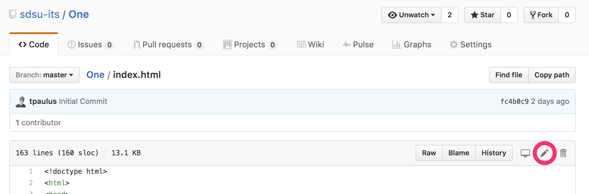
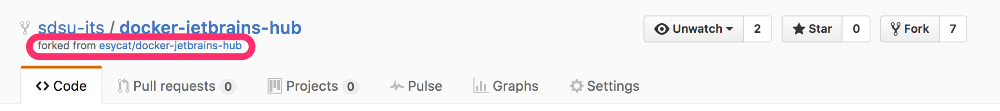
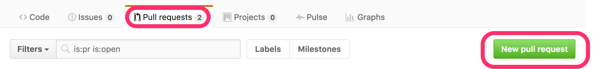
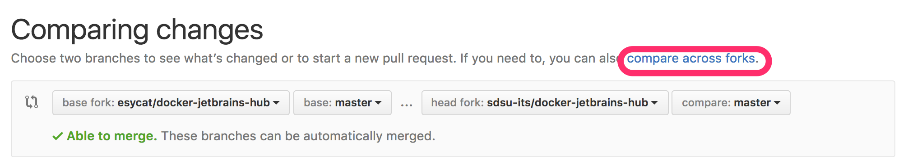

# Using GitHub

GitHub makes it super easy to make contributions via a process called Forking and submitting a Pull Request. This process requires that you have a GitHub account, which are free and easy to create. Depending on the branch permissions of the specific repository that you are working on, you may be able to push changes either directly to the `master` branch, or in any case the `develop` branch. The safest and most reliable way to contribute, however, is via Pull Requests.

**Fork - ** A copy of a repository that you manage. Forks let you make changes to a project without affecting the original repository. You can fetch updates from or submit changes to the original repository with pull requests.

If you view a file in the GitHub website, you can click on the edit button in the top right corner. 

Clicking on the edit button will create a fork of the repository in your GitHub account. You then can make all of the changes that your heart desires to your fork of the repository.

Once you have finished making your changes, you can submit a Pull Request, commonly abbreviated PR. Going back into the original repository, which can be accessed quickly by clicking on the link below the name of the repository. Click on the "Pull Requests" button.

Since you will be pulling between forks, you need to tell GitHub this. Click on the "Compare across forks" link to allow you to choose a different repository, instead of a branch of the parent repository.

Make sure that the merge can be completed \(as indicated by the "Able to merge" message\). If this is not the case, you likely have made a drastic number of changes, or you may need to pull and merge your fork before you submit your pull request.

Create a pull request, and include a title and message to your PR that describe what you did in your pull request. This helps the repository administrators understand your changes, and improves the likelihood of your PR being accepted and merged.

That's it! You just submitted your first Pull Request. You should be notified once your request has been accepted and merged with the parent repository.

